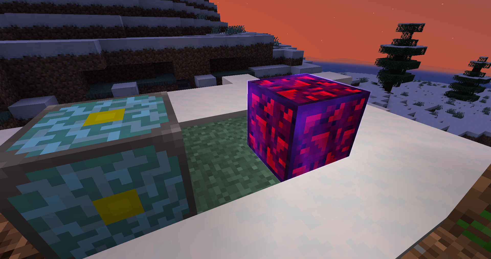
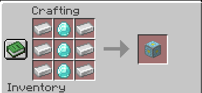
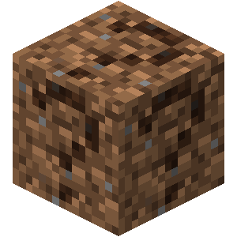
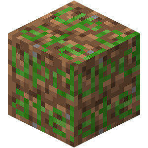

# Weird Wares
Weird wares for your wacky world! This mod adds various unobtainable and forgotten items, blocks, and features *plus a few extras*.

## Glitter
**Fair warning**: Excessive use of glitter may result in frame drops.

Glitter can be used to add enchantment glint to items and blocks in your world. In the inventory, select a stack of glitter, then apply (left click) the glitter on another item stack. Enchanted blocks that are placed down will appear enchanted in the world.

## Crafting
You can craft a Nether Reactor Core with by placing a vertical line of 3 iron ingots on the left, 3 diamonds in the middle, and 3 iron ingots on the right.

## Unobtainables
There are a few unobtainable blocks that Weird Wares adds to the Creative menu. For example, there is now an "info update" block and an Unknown block.

Credit to the Minecraft Wiki for renders of <a href="https://minecraft.wiki/w/File:Missing_Tile_BE3.png">unknown.png</a> and <a href="https://minecraft.wiki/w/File:Missing_Tile_BE1.png">info_update.png</a>.

## More to Come
This mod is in its early stages. New features will be released periodically as they are requested. There is no guarantee that any one idea will make it into the mod, but you may [create an issue](https://github.com/VulpixelMC/weird-wares/issues/new/choose) on the issue tracker.

## Usage Permission
You may use this mod in your Modpack provided you give adequate and direct credit, via a link to the mod's page as well as a copy of the source code. You may not redistribute binary builds of the Software if you do not also provide the Source Code.

## License
By contributing, you agree to the license terms found in LICENSE. You may create forks for the purpose of contributing code upstream.
